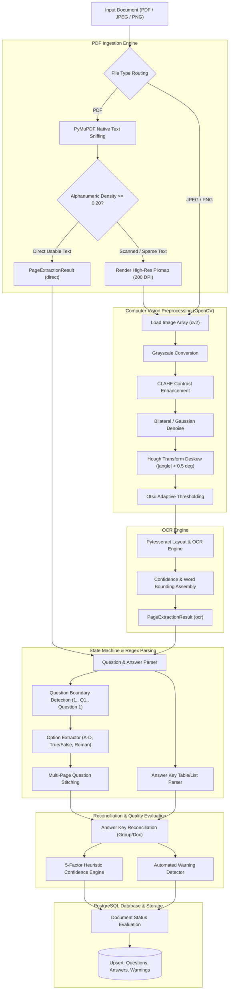

# Pragati Bharti – Document Processing & Question Extraction Service
## Architectural Design Specification

### 1. System Overview
The **Pragati Bharti Document Processing Service** is an enterprise-grade backend engineered to ingest multi-page examination documents (question papers, answer keys, mixed formats), validate and store assets securely, dispatch asynchronous background extraction tasks via Celery and Redis, and expose a secure, multi-tenant REST API.

```
                   +-----------------------------------------------+
                   |                   Client                      |
                   +-----------------------------------------------+
                                          |
                              Bearer JWT / Multipart
                                          v
                   +-----------------------------------------------+
                   |             FastAPI Application               |
                   |                                               |
                   |  - Authentication & Authorization             |
                   |  - Input / File Signature Sniffing            |
                   |  - Streamed Hashing & Path Traversal Guards   |
                   +-----------------------------------------------+
                             /                         \
           Save File Stream /                           \ Enqueue Task
                           v                             v
            +---------------------------+   +---------------------------+
            |    BaseStorageService     |   |       Redis Broker        |
            |     (LocalStorage)        |   +---------------------------+
            | (Modular S3 Interface)    |                 |
            +---------------------------+                 v
                           |                +---------------------------+
                           v                |       Celery Worker       |
            +---------------------------+   |                           |
            |   Local Storage Volume    |   | - File inspection         |
            |     (storage/uploads)     |   | - Status & progress update|
            +---------------------------+   | - Safe error persistence  |
                           ^                +---------------------------+
                           |                              |
                           +-------------+----------------+
                                         |
                                         v
                         +-------------------------------+
                         |      PostgreSQL 16 Engine     |
                         | - Users, Groups, Documents    |
                         | - Questions, Answers, Warnings|
                         +-------------------------------+
```

```mermaid
graph TD
    subgraph ClientLayer["Client Interaction"]
        Client["Client / API Consumer / Evaluator"]
    end

    subgraph FastAPILayer["FastAPI Gateway (Port 8000)"]
        Router["API Gateway / Routers (/api/v1)"]
        Auth["JWT Bearer Authentication & Multi-Tenant Guard"]
        Val["File Ingestion Guard (Magic Bytes, Size, Hash)"]
    end

    subgraph StorageLayer["Storage Abstraction Layer"]
        StorageContract["BaseStorageService"]
        LocalStorage["LocalStorageService (storage/uploads)"]
        S3Storage["S3StorageService (boto3 ready)"]
    end

    subgraph AsyncWorkerLayer["Asynchronous Task Processing"]
        RedisQueue[("Redis 7 (Broker & Result Backend)")]
        CeleryWorker["Celery Worker Fleet"]
        Pipeline["DocumentProcessingPipeline"]
    end

    subgraph DatabaseLayer["Relational Persistence"]
        Postgres[("PostgreSQL 16 Database Engine")]
    end

    Client -->|HTTP / Multipart / Bearer JWT| Router
    Router --> Auth
    Router --> Val
    Val -->|Stream Chunks| StorageContract
    StorageContract --> LocalStorage
    StorageContract -.-> S3Storage
    Val -->|Enqueue Task (document_id)| RedisQueue
    RedisQueue -->|Consume Task| CeleryWorker
    CeleryWorker --> Pipeline
    Pipeline -->|Read binary asset| StorageContract
    Pipeline -->|Upsert Questions, Answers, Warnings| Postgres
    Router -->|Query Documents, Questions, Warnings| Postgres
```

---

### 2. Core Architectural Principles

#### 2.1 File Storage Abstraction (`BaseStorageService`)
The service interacts with files strictly via an abstract contract:
- `save(content, filename) -> str`
- `get_path(filename) -> Path`
- `read(filename) -> bytes`
- `delete(filename) -> bool`
- `exists(filename) -> bool`

The current production implementation is `LocalStorageService`, which:
- Resolves all paths against `settings.UPLOAD_DIR`.
- Normalizes paths and verifies `resolved_path.relative_to(base_dir)` to prevent path traversal attacks (e.g., `../../etc/passwd`).
- Generates unguessable UUID-based server-side filenames (`<uuid4>.ext`), completely decoupling physical storage paths from untrusted client filenames.
- Streams files to disk in 64 KB chunks to avoid memory ballooning on large uploads.

Swapping in an `S3StorageService` (using `boto3`) requires zero changes to the controllers or business logic.

#### 2.2 Strict Upload Security & Content Sniffing
File uploads undergo multi-layer inspection before acceptance:
1. **Extension Whitelisting**: Strictly `.pdf`, `.jpg`, `.jpeg`, `.png`.
2. **Magic Byte Signature Sniffing**: Inspects the binary header bytes:
   - PDF: `%PDF-` (`0x25 0x50 0x44 0x46 0x2D`)
   - JPEG: `0xFF 0xD8 0xFF`
   - PNG: `0x89 0x50 0x4E 0x47 0x0D 0x0A 0x1A 0x0A`
3. **Empty File Rejection**: 0-byte uploads fail immediately with `400 Bad Request`.
4. **Streaming Size Limit**: As chunks stream into the buffer, the cumulative byte count is monitored. Exceeding `MAX_UPLOAD_SIZE_MB` terminates processing with `413 Payload Too Large`.
5. **SHA-256 Checksum**: Computed on-the-fly during file streaming, enabling deduplication and integrity tracking.

#### 2.3 Resilient Asynchronous Worker Architecture
- When a document is uploaded, the API creates a database record with status `QUEUED`, enqueues a background task in Celery, and immediately responds with `201 Created` containing the `document_id`.
- Celery uses Redis as broker and result backend.
- The worker executes `process_document_task`:
  - Changes status to `PROCESSING` and progress to `10%`.
  - Validates file presence on storage and reads the binary payload.
  - Inspects page count and structure (e.g. PDF object hierarchy).
  - On any failure, an outer `try...except` block catches the exception and updates the document status to `FAILED` with `error_message`, ensuring documents are never trapped in a perpetual `PROCESSING` state.
  - On success, updates status to `COMPLETED` and progress to `100%`.
- For testing environments, `CELERY_TASK_ALWAYS_EAGER=true` executes tasks synchronously, allowing deterministic automated test assertions without requiring an external running worker daemon.

#### 2.4 Multi-Tenant Authorization & Data Isolation
- Users register and receive signed JWT access tokens containing their subject UUID (`sub`).
- Every document and document group is strictly scoped by `owner_id`.
- Any attempt by User B to access, update, or assign User A's document returns a `403 Forbidden` or `404 Not Found`.

---

### 3. Database Schema Design (SQLAlchemy 2.x & Alembic)

1. **`users`**:
   - `id` (UUID PK), `email` (unique index), `password_hash`, `created_at`.
2. **`document_groups`**:
   - `id` (UUID PK), `owner_id` (FK to users.id on delete CASCADE), `name`, `description`, `created_at`.
3. **`documents`**:
   - `id` (UUID PK), `owner_id` (FK), `group_id` (FK to document_groups.id on delete SET NULL).
   - `original_filename`, `stored_filename` (unique), `mime_type`, `file_size`, `file_hash` (SHA-256).
   - `document_role` (`QUESTION_PAPER`, `ANSWER_KEY`, `MIXED`, `UNKNOWN`).
   - `status` (`QUEUED`, `PROCESSING`, `COMPLETED`, `PARTIAL`, `FAILED`), `progress` (0-100), `error_message`, `page_count`.
   - `created_at`, `updated_at`.
4. **`questions`**:
   - `id` (UUID PK), `document_id` (FK to documents.id on delete CASCADE).
   - `question_number`, `question_text`, `question_type`, `options` (JSONB), `answer`, `source_pages` (JSONB), `confidence`, `needs_review`, `extraction_metadata` (JSONB), `created_at`.
5. **`answers`**:
   - `id` (UUID PK), `question_id` (FK nullable), `source_document_id` (FK to documents.id), `question_number`, `answer_text`, `confidence`, `source_page`, `matched`.
6. **`extraction_warnings`**:
   - `id` (UUID PK), `document_id` (FK), `question_id` (FK nullable), `warning_type`, `message`, `page_number`, `confidence`, `created_at`.

---

### 4. Document Processing & Question Extraction Pipeline Architecture

The extraction pipeline (`app/services/extraction/`) is designed as a modular, fault-tolerant state-machine engine:

```
[Uploaded Document (PDF / Image)]
                |
                v
+-------------------------------+
| Pipeline Orchestrator         |  Update Document: PROCESSING (10%)
+-------------------------------+
                |
       +--------+--------+
       |                 |
  (PDF Document)    (Raster Image: PNG/JPG)
       |                 |
       v                 v
+---------------+  +-----------------------------------------------+
| PyMuPDF Fitz  |  | Image Preprocessing Engine (OpenCV)          |
| Text Sniffing |  | - Grayscale & Contrast (CLAHE)               |
+---------------+  | - Median/Gaussian Denoise & Otsu Threshold    |
       |           | - Deskew / Hough Orientation Correction       |
 [Usable Text?]    +-----------------------------------------------+
  /          \                             |
(Yes)        (No / Scanned)                v
  |            |               +-----------------------------------+
  |      Render High-Res       | Pytesseract OCR Wrapper           |
  |      Pixmap (200 DPI)      | - Extract text & word confidence  |
  |            |               | - Calculate page mean confidence  |
  |            +-------------->+-----------------------------------+
  |                                            |
  +--------------------+-----------------------+
                       v
       +-------------------------------+
       | Page Text & Metadata Assembler|  Progress: 60%
       +-------------------------------+
                       |
       +---------------+---------------+
       |                               |
       v                               v
+-----------------------------+ +-----------------------------+
| Question Parser Engine      | | Answer Key Parser & Detector|
| - State machine & regex     | | - Detect header boundaries  |
| - Numbering normalization   | | - Table / List key mapping  |
| - Option extractor (A-D)    | | - Raw answer record storage |
| - Multi-page stitching      | +-----------------------------+
| - Question categorization   |                |
+-----------------------------+                |
               |                               |
               +---------------+---------------+
                               v
               +-------------------------------+
               | Answer Matcher                |
               | - Normalized Q# reconciliation|
               | - Populate question.answer    |
               +-------------------------------+
                               |
               +---------------+---------------+
               |                               |
               v                               v
+-------------------------------+ +-------------------------------+
| Heuristic Confidence Engine   | | Warning Evaluation Service    |
| - Boundary strength (25%)     | | - LOW_OCR_CONFIDENCE          |
| - OCR confidence (25%)        | | - POSSIBLE_INCOMPLETE_QUESTION|
| - Option consistency (20%)    | | - MISSING_QUESTION_NUMBER     |
| - Question sequence (15%)     | | - OPTION_PARSE_UNCERTAIN      |
| - Answer key match (15%)      | | - ANSWER_UNMATCHED            |
+-------------------------------+ | - POSSIBLE_VISUAL_CONTENT     |
               |                  +-------------------------------+
               v                               |
+----------------------------------------------+
| Database Persistence & Lifecycle Finalizer   |  Progress: 100%
| - Save Questions, Answers, Warnings          |
| - If avg confidence >= 0.80 & no crit warn:  |
|     Status -> COMPLETED                      |
| - If questions found but confidence < 0.80:  |
|     Status -> PARTIAL                        |
| - If zero usable content / fatal failure:    |
|     Status -> FAILED                         |
+----------------------------------------------+
```



#### 4.1 Hybrid Text Extraction Strategy
- **Direct PyMuPDF Ingestion**: Fast extraction of digitally generated text (`page.get_text()`).
- **Text Usability Analysis**: Evaluates printable character ratios and alphanumeric density. Pages with sparse or garbled text trigger rasterization at 200 DPI for OCR.
- **Embedded Drawing & Image Detection**: Detects vector drawings and embedded bitmaps to identify possible visual content and generate review warnings.

#### 4.2 OpenCV Image Preprocessing
- **Grayscale Conversion**: Eliminates color noise.
- **CLAHE (Contrast Limited Adaptive Histogram Equalization)**: Amplifies faint pencil or low-contrast markings.
- **Noise Reduction**: Bilateral and Gaussian filtering to eliminate scan artifacts without blurring character edges.
- **Deskew Correction**: Uses `cv2.minAreaRect` on thresholded text blocks to compute rotation angle, rotating if $|angle| > 0.5^\circ$.
- **Otsu Binarization**: Produces crisp black-and-white input for the OCR engine.

#### 4.3 Regex & State-Machine Question Parser
- **Question Numbering Variants**: Recognizes `1.`, `1)`, `Q1.`, `Q.1`, `Question 1:`, `(1)`, `1:`.
- **Option Extraction**: Parses options formatted as `A.`, `A)`, `(A)`, `a.`, `(a)`, `1)`, `(i)`.
- **Multi-Page Question Stitching**: If a question starts near the bottom of Page $N$ and continues onto Page $N+1$ without encountering a new question boundary, the text is stitched together and recorded with `source_pages: [N, N+1]`.
- **Question Classification**: Categorizes into `MCQ`, `TRUE_FALSE`, `SHORT_ANSWER`, `DESCRIPTIVE`, or `UNKNOWN`.

#### 4.4 Heuristic Confidence Scoring (0.0 to 1.0)
Documented non-probabilistic heuristic combining five distinct signals:
1. **OCR / Direct Quality (25%)**: 1.0 for direct vector text; scaled mean word confidence for OCR.
2. **Boundary Match Quality (25%)**: Evaluates regex strength and clean question prefix separation.
3. **Option Consistency (20%)**: Checks sequential ordering (e.g. A, B, C, D) and minimum option length.
4. **Sequence Progression (15%)**: Confirms monotonically increasing question numbers.
5. **Answer Match (15%)**: Bonus for matching an extracted answer key entry.

**Thresholds**:
- $\ge 0.80$: High confidence (`needs_review = false`).
- $0.60 - 0.79$: Medium confidence (`needs_review = true` if options or boundaries were ambiguous).
- $< 0.60$: Low confidence (`needs_review = true`).

